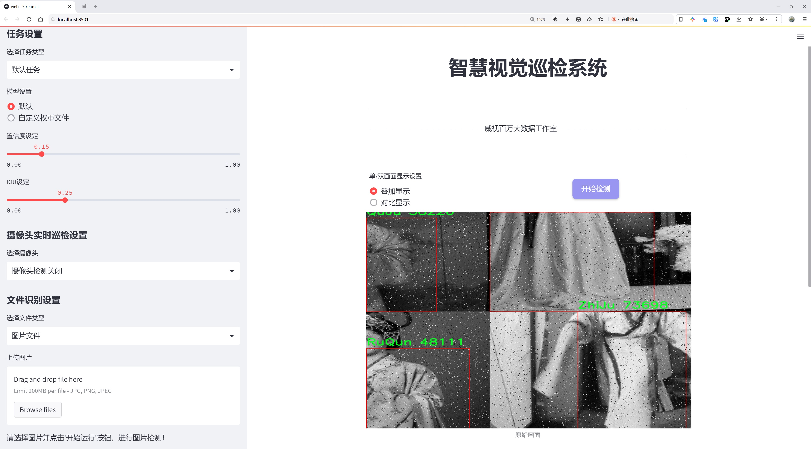

# 传统服饰识别检测系统源码分享
 # [一条龙教学YOLOV8标注好的数据集一键训练_70+全套改进创新点发刊_Web前端展示]

### 1.研究背景与意义

项目参考[AAAI Association for the Advancement of Artificial Intelligence](https://gitee.com/qunshansj/projects)

项目来源[AACV Association for the Advancement of Computer Vision](https://gitee.com/qunmasj/projects)

研究背景与意义

随着全球化的加速和文化交流的频繁，传统服饰作为文化遗产的重要组成部分，越来越受到人们的关注。中国传统服饰不仅承载着丰富的历史文化信息，还体现了独特的美学价值和社会功能。然而，传统服饰的多样性和复杂性使得其识别与分类面临诸多挑战。为了有效保护和传承这一文化遗产，开发高效的传统服饰识别系统显得尤为重要。

近年来，深度学习技术的迅猛发展为图像识别领域带来了革命性的变化。尤其是YOLO（You Only Look Once）系列模型，以其高效的实时目标检测能力，广泛应用于各类视觉识别任务中。YOLOv8作为该系列的最新版本，结合了更为先进的网络结构和算法优化，具备了更高的检测精度和速度。因此，基于改进YOLOv8的传统服饰识别系统，不仅能够提高传统服饰的识别率，还能为相关领域的研究提供强有力的技术支持。

本研究所使用的“中国传统服饰数据集”包含1600张图像，涵盖了8个类别，包括AoQun（袄裙）、DaoPao（道袍）、Pao（袍）、QuJu（裙褂）、RuQun（襦裙）、ZhiDuo（直裰）、ZhiJu（直裙）和ZhuZiShenYi（朱子深衣）。这些类别代表了中国传统服饰的多样性，涵盖了不同历史时期和地域的服饰风格。通过对这些图像的分析与处理，研究者能够深入挖掘传统服饰的文化内涵和社会背景，从而为传统文化的传承与创新提供新的视角。

在技术层面上，改进YOLOv8模型的引入，使得传统服饰的识别过程更加高效和准确。传统的图像识别方法往往依赖于手工特征提取，容易受到环境变化和图像质量的影响。而YOLOv8通过深度学习算法，能够自动提取图像特征，显著提高了识别的鲁棒性。此外，改进后的模型在处理多类别目标时，能够有效降低误识别率，为传统服饰的精确分类提供了保障。

本研究的意义不仅在于技术层面的创新，更在于其对传统文化的保护与传承的推动。通过建立高效的传统服饰识别系统，可以为相关领域的研究者、设计师和文化工作者提供便利，促进传统服饰的数字化管理和展示。同时，该系统也为传统服饰的教育与普及提供了新的途径，使更多的人能够了解和欣赏中国传统文化的博大精深。

综上所述，基于改进YOLOv8的传统服饰识别系统的研究，不仅具有重要的学术价值，也在文化传承和社会应用方面展现出广阔的前景。通过这一研究，我们期望能够为传统服饰的保护与发展贡献一份力量，同时推动深度学习技术在文化遗产领域的应用与发展。

### 2.图片演示





##### 注意：由于此博客编辑较早，上面“2.图片演示”和“3.视频演示”展示的系统图片或者视频可能为老版本，新版本在老版本的基础上升级如下：（实际效果以升级的新版本为准）

  （1）适配了YOLOV8的“目标检测”模型和“实例分割”模型，通过加载相应的权重（.pt）文件即可自适应加载模型。

  （2）支持“图片识别”、“视频识别”、“摄像头实时识别”三种识别模式。

  （3）支持“图片识别”、“视频识别”、“摄像头实时识别”三种识别结果保存导出，解决手动导出（容易卡顿出现爆内存）存在的问题，识别完自动保存结果并导出到tempDir中。

  （4）支持Web前端系统中的标题、背景图等自定义修改，后面提供修改教程。

  另外本项目提供训练的数据集和训练教程,暂不提供权重文件（best.pt）,需要您按照教程进行训练后实现图片演示和Web前端界面演示的效果。

### 3.视频演示

[3.1 视频演示](https://www.bilibili.com/video/BV1pS4bejEEn/)

### 4.数据集信息展示

##### 4.1 本项目数据集详细数据（类别数＆类别名）

nc: 8
names: ['AoQun', 'DaoPao', 'Pao', 'QuJu', 'RuQun', 'ZhiDuo', 'ZhiJu', 'ZhuZiShenYi']


##### 4.2 本项目数据集信息介绍

数据集信息展示

在本研究中，我们采用了名为“Chinese-Traditional-Clothing Dataset”的数据集，以改进YOLOv8在传统服饰识别系统中的表现。该数据集专注于中国传统服饰的多样性，涵盖了八个主要类别，旨在为计算机视觉领域提供丰富的训练样本，以提升模型在识别和分类传统服饰方面的准确性和鲁棒性。

数据集中包含的类别包括：AoQun（袄裙）、DaoPao（道袍）、Pao（袍）、QuJu（裙褂）、RuQun（如裙）、ZhiDuo（直裰）、ZhiJu（直筒裙）和ZhuZiShenYi（朱子深衣）。这些类别不仅反映了中国传统服饰的丰富文化内涵，也展现了不同历史时期和地域的服饰特色。每个类别都代表了独特的设计元素、材料和穿着方式，能够帮助模型学习到细致的特征，从而在实际应用中实现更高的识别精度。

在数据集的构建过程中，研究团队注重数据的多样性和代表性，确保每个类别都包含足够的样本，以覆盖不同的风格、颜色和图案。这种多样性使得模型能够更好地理解和区分各类服饰，进而提高其在实际应用中的适应能力。例如，AoQun作为一种常见的传统服饰，其样本可能包括不同的款式和色彩，而DaoPao则可能展现出不同的刺绣和装饰风格。这种细致的分类和丰富的样本将为YOLOv8的训练提供坚实的基础。

此外，数据集还经过精心标注，确保每个样本的类别标签准确无误。这一过程不仅提高了数据集的质量，也为后续的模型训练提供了可靠的依据。通过对数据集的深入分析，我们发现，不同类别之间的相似性和差异性为模型的学习提供了挑战和机遇。在训练过程中，YOLOv8将能够通过对这些细微差别的学习，提升其在复杂场景下的识别能力。

在数据预处理阶段，我们还对图像进行了标准化处理，以确保输入数据的一致性。这一过程包括图像的缩放、裁剪和增强等操作，旨在提高模型的泛化能力。通过引入数据增强技术，我们能够模拟不同的拍摄条件和环境变化，从而使模型在面对真实世界中的各种挑战时，依然能够保持高效的识别性能。

总之，“Chinese-Traditional-Clothing Dataset”不仅为本研究提供了丰富的训练数据，也为传统服饰的数字化保护和传播开辟了新的路径。通过对该数据集的深入挖掘和应用，我们期待能够在传统服饰识别领域取得突破性进展，推动相关技术的发展和应用，为文化遗产的保护与传承贡献一份力量。


### 5.全套项目环境部署视频教程（零基础手把手教学）

[5.1 环境部署教程链接（零基础手把手教学）](https://www.ixigua.com/7404473917358506534?logTag=c807d0cbc21c0ef59de5)


[5.2 安装Python虚拟环境创建和依赖库安装视频教程链接（零基础手把手教学）](https://www.ixigua.com/7404474678003106304?logTag=1f1041108cd1f708b01a)

### 6.手把手YOLOV8训练视频教程（零基础小白有手就能学会）

[6.1 手把手YOLOV8训练视频教程（零基础小白有手就能学会）](https://www.ixigua.com/7404477157818401292?logTag=d31a2dfd1983c9668658)

### 7.70+种全套YOLOV8创新点代码加载调参视频教程（一键加载写好的改进模型的配置文件）

[7.1 70+种全套YOLOV8创新点代码加载调参视频教程（一键加载写好的改进模型的配置文件）](https://www.ixigua.com/7404478314661806627?logTag=29066f8288e3f4eea3a4)

### 8.70+种全套YOLOV8创新点原理讲解（非科班也可以轻松写刊发刊，V10版本正在科研待更新）

由于篇幅限制，每个创新点的具体原理讲解就不一一展开，具体见下列网址中的创新点对应子项目的技术原理博客网址【Blog】：


[8.1 70+种全套YOLOV8创新点原理讲解链接](https://gitee.com/qunmasj/good)

### 9.系统功能展示（检测对象为举例，实际内容以本项目数据集为准）

图9.1.系统支持检测结果表格显示

  图9.2.系统支持置信度和IOU阈值手动调节

  图9.3.系统支持自定义加载权重文件best.pt(需要你通过步骤5中训练获得)

  图9.4.系统支持摄像头实时识别

  图9.5.系统支持图片识别

  图9.6.系统支持视频识别

  图9.7.系统支持识别结果文件自动保存

  图9.8.系统支持Excel导出检测结果数据


### 10.原始YOLOV8算法原理

原始YOLOv8算法原理

YOLOv8作为YOLO系列中的最新一代目标检测算法，继承并发展了前几代算法的核心思想，同时在多个方面进行了创新与优化。其设计目标是提高目标检测的速度和精度，特别是在嵌入式设备和实时应用场景中的表现。YOLOv8的网络结构分为三个主要部分：Backbone、Neck和Head，每个部分都有其独特的功能和设计理念。

在Backbone部分，YOLOv8采用了一系列卷积和反卷积层，结合残差连接和瓶颈结构，旨在高效提取图像特征。与前几代YOLO算法相比，YOLOv8在Backbone中引入了C2模块作为基本构成单元，这一模块的设计不仅提高了特征提取的效率，还有效减小了网络的整体规模。Backbone由5个CBS模块、4个C2f模块和1个快速空间金字塔池化(SPPF)模块组成。CBS模块通过卷积操作和激活函数的结合，增强了特征的表达能力；而C2f模块则结合了CSPNet的思想，增加了残差连接的数量，从而丰富了梯度信息，提升了网络的学习能力。SPPF模块则通过空间金字塔池化技术，进一步增强了对多尺度特征的捕捉能力，为后续的目标检测提供了更加全面的特征支持。

Neck部分的设计则采用了多尺度特征融合技术，旨在整合来自Backbone不同阶段的特征图。通过对不同尺度特征的有效融合，YOLOv8能够更好地捕捉到不同大小目标的信息，提升了目标检测的性能和鲁棒性。这一部分的创新在于引入了PAN-FPN的思想，使得特征融合更加灵活和高效。PAN-FPN通过自底向上的路径增强特征的传递，同时自顶向下的路径则确保了高层语义信息的有效利用，从而实现了对目标的精准定位。

在Head部分，YOLOv8进行了重要的结构性创新，采用了解耦合头的设计，将分类和回归任务分为两个独立的分支。这一设计的优势在于，分类和回归任务可以各自专注于自身的目标，从而有效解决了复杂场景下定位不准及分类错误的问题。此外，YOLOv8还摒弃了传统的Anchor-Based方法，转而采用Anchor-Free的目标检测方式。这种方法直接预测目标的位置和大小，简化了模型的设计，同时提高了检测的速度和准确性。通过这种回归方式，YOLOv8能够更快地聚焦于目标位置的邻近点，使得预测框更接近于实际边界框区域。

YOLOv8在训练过程中也进行了多项优化。在数据增强方面，YOLOv8借鉴了YOLOv5中的策略，特别是在训练的最后10个epoch中关闭马赛克增强，减少了数据噪声的影响。同时，采用动态Task-Aligned Assigner样本分配策略，使得训练过程更加高效。此外，在损失计算方面，YOLOv8使用了BCELoss作为分类损失，DFLLoss与CIoULoss作为回归损失，这种组合能够更好地平衡分类和回归任务的学习效果，提升模型的整体性能。

值得一提的是，YOLOv8提供了五种不同规模的模型，包括YOLOv8n、YOLOv8s、YOLOv8m、YOLOv8l和YOLOv8x。这些模型的设计不仅考虑了网络的深度和宽度，还根据不同应用场景的需求进行了相应的调整，使得YOLOv8在多种设备上都能实现高效的目标检测。这种灵活性使得YOLOv8能够广泛应用于从嵌入式设备到高性能计算平台的各种场景，满足了实时检测的需求。

总的来说，YOLOv8通过在Backbone、Neck和Head三个部分的创新设计，结合高效的特征提取和融合技术，极大地提升了目标检测的速度和精度。其Anchor-Free的设计理念和解耦合头的结构，使得YOLOv8在复杂场景下的表现更加出色。随着YOLOv8的推出，目标检测领域的研究和应用将迎来新的机遇，推动智能视觉技术的进一步发展。


### 11.项目核心源码讲解（再也不用担心看不懂代码逻辑）

#### 11.1 code\ultralytics\utils\tal.py

以下是经过精简和注释的核心代码部分，保留了最重要的功能和逻辑。

```python
import torch
import torch.nn as nn
from .metrics import bbox_iou  # 引入IoU计算函数

class TaskAlignedAssigner(nn.Module):
    """
    任务对齐分配器，用于目标检测。
    该类根据任务对齐度量将真实目标分配给锚框，结合了分类和定位信息。
    """

    def __init__(self, topk=13, num_classes=80, alpha=1.0, beta=6.0, eps=1e-9):
        """初始化任务对齐分配器，设置超参数。"""
        super().__init__()
        self.topk = topk  # 考虑的候选框数量
        self.num_classes = num_classes  # 目标类别数量
        self.bg_idx = num_classes  # 背景类别索引
        self.alpha = alpha  # 分类组件的权重
        self.beta = beta  # 定位组件的权重
        self.eps = eps  # 防止除零的小值

    @torch.no_grad()
    def forward(self, pd_scores, pd_bboxes, anc_points, gt_labels, gt_bboxes, mask_gt):
        """
        计算任务对齐分配。
        参数：
            pd_scores: 预测的得分
            pd_bboxes: 预测的边界框
            anc_points: 锚框中心点
            gt_labels: 真实目标标签
            gt_bboxes: 真实目标边界框
            mask_gt: 真实目标掩码
        返回：
            target_labels: 目标标签
            target_bboxes: 目标边界框
            target_scores: 目标得分
            fg_mask: 前景掩码
            target_gt_idx: 目标索引
        """
        self.bs = pd_scores.size(0)  # 批次大小
        self.n_max_boxes = gt_bboxes.size(1)  # 最大目标数量

        if self.n_max_boxes == 0:  # 如果没有真实目标
            device = gt_bboxes.device
            return (
                torch.full_like(pd_scores[..., 0], self.bg_idx).to(device),
                torch.zeros_like(pd_bboxes).to(device),
                torch.zeros_like(pd_scores).to(device),
                torch.zeros_like(pd_scores[..., 0]).to(device),
                torch.zeros_like(pd_scores[..., 0]).to(device),
            )

        # 获取正样本掩码、对齐度量和重叠度
        mask_pos, align_metric, overlaps = self.get_pos_mask(
            pd_scores, pd_bboxes, gt_labels, gt_bboxes, anc_points, mask_gt
        )

        # 选择重叠度最高的目标
        target_gt_idx, fg_mask, mask_pos = self.select_highest_overlaps(mask_pos, overlaps, self.n_max_boxes)

        # 获取目标标签、边界框和得分
        target_labels, target_bboxes, target_scores = self.get_targets(gt_labels, gt_bboxes, target_gt_idx, fg_mask)

        # 归一化对齐度量
        align_metric *= mask_pos
        pos_align_metrics = align_metric.amax(dim=-1, keepdim=True)  # 计算正样本的最大对齐度量
        pos_overlaps = (overlaps * mask_pos).amax(dim=-1, keepdim=True)  # 计算正样本的最大重叠度
        norm_align_metric = (align_metric * pos_overlaps / (pos_align_metrics + self.eps)).amax(-2).unsqueeze(-1)
        target_scores = target_scores * norm_align_metric  # 更新目标得分

        return target_labels, target_bboxes, target_scores, fg_mask.bool(), target_gt_idx

    def get_pos_mask(self, pd_scores, pd_bboxes, gt_labels, gt_bboxes, anc_points, mask_gt):
        """获取正样本掩码和对齐度量。"""
        mask_in_gts = self.select_candidates_in_gts(anc_points, gt_bboxes)  # 选择在真实目标内的锚框
        align_metric, overlaps = self.get_box_metrics(pd_scores, pd_bboxes, gt_labels, gt_bboxes, mask_in_gts * mask_gt)  # 计算对齐度量和重叠度
        mask_topk = self.select_topk_candidates(align_metric, topk_mask=mask_gt.expand(-1, -1, self.topk).bool())  # 选择top-k候选框
        mask_pos = mask_topk * mask_in_gts * mask_gt  # 合并掩码

        return mask_pos, align_metric, overlaps

    def get_box_metrics(self, pd_scores, pd_bboxes, gt_labels, gt_bboxes, mask_gt):
        """计算预测边界框与真实边界框的对齐度量。"""
        na = pd_bboxes.shape[-2]  # 锚框数量
        mask_gt = mask_gt.bool()  # 转换为布尔类型
        overlaps = torch.zeros([self.bs, self.n_max_boxes, na], dtype=pd_bboxes.dtype, device=pd_bboxes.device)  # 初始化重叠度
        bbox_scores = torch.zeros([self.bs, self.n_max_boxes, na], dtype=pd_scores.dtype, device=pd_scores.device)  # 初始化边界框得分

        ind = torch.zeros([2, self.bs, self.n_max_boxes], dtype=torch.long)  # 创建索引
        ind[0] = torch.arange(end=self.bs).view(-1, 1).expand(-1, self.n_max_boxes)  # 批次索引
        ind[1] = gt_labels.squeeze(-1)  # 真实目标标签索引
        bbox_scores[mask_gt] = pd_scores[ind[0], :, ind[1]][mask_gt]  # 获取每个锚框的得分

        # 计算IoU
        pd_boxes = pd_bboxes.unsqueeze(1).expand(-1, self.n_max_boxes, -1, -1)[mask_gt]
        gt_boxes = gt_bboxes.unsqueeze(2).expand(-1, -1, na, -1)[mask_gt]
        overlaps[mask_gt] = self.iou_calculation(gt_boxes, pd_boxes)  # 计算重叠度

        align_metric = bbox_scores.pow(self.alpha) * overlaps.pow(self.beta)  # 计算对齐度量
        return align_metric, overlaps

    def iou_calculation(self, gt_bboxes, pd_bboxes):
        """计算IoU。"""
        return bbox_iou(gt_bboxes, pd_bboxes, xywh=False, CIoU=True).squeeze(-1).clamp_(0)  # 使用IoU函数计算重叠度

    def select_topk_candidates(self, metrics, largest=True, topk_mask=None):
        """选择top-k候选框。"""
        topk_metrics, topk_idxs = torch.topk(metrics, self.topk, dim=-1, largest=largest)  # 获取top-k指标和索引
        if topk_mask is None:
            topk_mask = (topk_metrics.max(-1, keepdim=True)[0] > self.eps).expand_as(topk_idxs)  # 生成top-k掩码
        topk_idxs.masked_fill_(~topk_mask, 0)  # 填充无效索引

        count_tensor = torch.zeros(metrics.shape, dtype=torch.int8, device=topk_idxs.device)  # 初始化计数张量
        ones = torch.ones_like(topk_idxs[:, :, :1], dtype=torch.int8, device=topk_idxs.device)  # 创建全1张量
        for k in range(self.topk):
            count_tensor.scatter_add_(-1, topk_idxs[:, :, k : k + 1], ones)  # 统计top-k索引

        count_tensor.masked_fill_(count_tensor > 1, 0)  # 过滤无效边界框
        return count_tensor.to(metrics.dtype)  # 返回有效计数

    def get_targets(self, gt_labels, gt_bboxes, target_gt_idx, fg_mask):
        """计算目标标签、边界框和得分。"""
        batch_ind = torch.arange(end=self.bs, dtype=torch.int64, device=gt_labels.device)[..., None]
        target_gt_idx = target_gt_idx + batch_ind * self.n_max_boxes  # 计算目标索引
        target_labels = gt_labels.long().flatten()[target_gt_idx]  # 获取目标标签

        target_bboxes = gt_bboxes.view(-1, gt_bboxes.shape[-1])[target_gt_idx]  # 获取目标边界框
        target_labels.clamp_(0)  # 限制标签范围

        target_scores = torch.zeros(
            (target_labels.shape[0], target_labels.shape[1], self.num_classes),
            dtype=torch.int64,
            device=target_labels.device,
        )  # 初始化目标得分
        target_scores.scatter_(2, target_labels.unsqueeze(-1), 1)  # 根据标签填充得分

        fg_scores_mask = fg_mask[:, :, None].repeat(1, 1, self.num_classes)  # 扩展前景掩码
        target_scores = torch.where(fg_scores_mask > 0, target_scores, 0)  # 过滤背景得分

        return target_labels, target_bboxes, target_scores  # 返回目标标签、边界框和得分

    @staticmethod
    def select_candidates_in_gts(xy_centers, gt_bboxes, eps=1e-9):
        """选择在真实目标内的锚框。"""
        n_anchors = xy_centers.shape[0]
        bs, n_boxes, _ = gt_bboxes.shape
        lt, rb = gt_bboxes.view(-1, 1, 4).chunk(2, 2)  # 获取左上角和右下角
        bbox_deltas = torch.cat((xy_centers[None] - lt, rb - xy_centers[None]), dim=2).view(bs, n_boxes, n_anchors, -1)
        return bbox_deltas.amin(3).gt_(eps)  # 返回在真实目标内的锚框

    @staticmethod
    def select_highest_overlaps(mask_pos, overlaps, n_max_boxes):
        """选择重叠度最高的目标。"""
        fg_mask = mask_pos.sum(-2)  # 计算前景掩码
        if fg_mask.max() > 1:  # 如果一个锚框分配给多个真实目标
            mask_multi_gts = (fg_mask.unsqueeze(1) > 1).expand(-1, n_max_boxes, -1)  # 生成多目标掩码
            max_overlaps_idx = overlaps.argmax(1)  # 获取最大重叠度索引

            is_max_overlaps = torch.zeros(mask_pos.shape, dtype=mask_pos.dtype, device=mask_pos.device)
            is_max_overlaps.scatter_(1, max_overlaps_idx.unsqueeze(1), 1)  # 标记最大重叠度

            mask_pos = torch.where(mask_multi_gts, is_max_overlaps, mask_pos).float()  # 更新掩码
            fg_mask = mask_pos.sum(-2)  # 更新前景掩码
        target_gt_idx = mask_pos.argmax(-2)  # 获取目标索引
        return target_gt_idx, fg_mask, mask_pos  # 返回目标索引、前景掩码和掩码

# 其他辅助函数（如生成锚框、距离与边界框转换等）可以根据需要保留或删除
```

### 代码说明
1. **TaskAlignedAssigner类**: 这是一个核心类，用于将真实目标分配给锚框，结合了分类和定位信息。
2. **forward方法**: 计算任务对齐分配，返回目标标签、边界框、得分等信息。
3. **get_pos_mask方法**: 获取正样本掩码和对齐度量。
4. **get_box_metrics方法**: 计算预测边界框与真实边界框的对齐度量。
5. **iou_calculation方法**: 计算IoU（Intersection over Union）。
6. **select_topk_candidates方法**: 选择top-k候选框。
7. **get_targets方法**: 计算目标标签、边界框和得分。
8. **select_candidates_in_gts方法**: 选择在真实目标内的锚框。
9. **select_highest_overlaps方法**: 选择重叠度最高的目标。

其他辅助函数如生成锚框、距离与边界框转换等可以根据需要进行保留或删除。

这个文件定义了一个用于目标检测的任务对齐分配器（TaskAlignedAssigner），其主要功能是将真实目标（ground-truth）对象分配给锚框（anchors），以便于后续的分类和定位任务。这个类结合了分类和定位信息，通过计算任务对齐度量来进行分配。

在初始化方法中，定义了一些超参数，包括考虑的候选框数量（topk）、类别数量（num_classes）、分类和定位组件的权重（alpha和beta），以及一个小的常数（eps）用于防止除零错误。

在前向传播方法中，输入包括预测的分数（pd_scores）、预测的边界框（pd_bboxes）、锚点（anc_points）、真实标签（gt_labels）、真实边界框（gt_bboxes）和真实目标的掩码（mask_gt）。该方法首先检查是否有真实目标，如果没有，则返回背景标签和零的边界框和分数。接着，通过调用`get_pos_mask`方法计算正样本的掩码、对齐度量和重叠度。然后，使用`select_highest_overlaps`方法选择重叠度最高的锚框，并通过`get_targets`方法获取目标标签、目标边界框和目标分数。最后，对对齐度量进行归一化，并返回目标标签、目标边界框、目标分数、前景掩码和目标索引。

`get_pos_mask`方法用于获取正样本的掩码，计算对齐度量和重叠度。`get_box_metrics`方法计算给定预测和真实边界框的对齐度量。`iou_calculation`方法用于计算真实边界框和预测边界框之间的交并比（IoU）。`select_topk_candidates`方法根据给定的度量选择前k个候选框。`get_targets`方法计算正锚点的目标标签、目标边界框和目标分数。

此外，文件中还定义了一个用于处理旋转边界框的类`RotatedTaskAlignedAssigner`，它重写了IoU计算和选择候选框的方法，以适应旋转边界框的特性。

最后，文件中还包含了一些辅助函数，例如`make_anchors`用于生成锚框，`dist2bbox`和`bbox2dist`用于在不同表示形式之间转换边界框，`dist2rbox`用于解码预测的旋转边界框坐标。

整体而言，这个文件实现了一个复杂的目标检测分配机制，旨在提高模型在目标检测任务中的性能。

#### 11.2 code\ultralytics\trackers\byte_tracker.py

以下是代码中最核心的部分，并附上详细的中文注释：

```python
import numpy as np
from .basetrack import BaseTrack, TrackState
from .utils import matching
from .utils.kalman_filter import KalmanFilterXYAH

class STrack(BaseTrack):
    """
    单目标跟踪表示，使用卡尔曼滤波进行状态估计。

    该类负责存储与单个跟踪相关的所有信息，并基于卡尔曼滤波进行状态更新和预测。
    """

    shared_kalman = KalmanFilterXYAH()  # 共享的卡尔曼滤波器，用于所有STrack实例的预测

    def __init__(self, tlwh, score, cls):
        """初始化新的STrack实例。"""
        super().__init__()
        # 将输入的边界框转换为tlwh格式并存储
        self._tlwh = np.asarray(self.tlbr_to_tlwh(tlwh[:-1]), dtype=np.float32)
        self.kalman_filter = None  # 当前对象跟踪的卡尔曼滤波器实例
        self.mean, self.covariance = None, None  # 状态均值和协方差
        self.is_activated = False  # 跟踪是否已激活

        self.score = score  # 跟踪的置信度分数
        self.tracklet_len = 0  # 跟踪长度
        self.cls = cls  # 对象的类别标签
        self.idx = tlwh[-1]  # 对象的索引

    def predict(self):
        """使用卡尔曼滤波器预测对象的下一个状态。"""
        mean_state = self.mean.copy()  # 复制当前均值状态
        if self.state != TrackState.Tracked:  # 如果状态不是跟踪状态
            mean_state[7] = 0  # 将速度设为0
        # 通过卡尔曼滤波器进行预测
        self.mean, self.covariance = self.kalman_filter.predict(mean_state, self.covariance)

    def activate(self, kalman_filter, frame_id):
        """激活新的跟踪。"""
        self.kalman_filter = kalman_filter  # 设置卡尔曼滤波器
        self.track_id = self.next_id()  # 获取新的跟踪ID
        # 初始化状态均值和协方差
        self.mean, self.covariance = self.kalman_filter.initiate(self.convert_coords(self._tlwh))
        self.tracklet_len = 0  # 重置跟踪长度
        self.state = TrackState.Tracked  # 设置状态为跟踪
        if frame_id == 1:
            self.is_activated = True  # 如果是第一帧，激活跟踪
        self.frame_id = frame_id  # 设置当前帧ID
        self.start_frame = frame_id  # 设置开始帧ID

    def update(self, new_track, frame_id):
        """
        更新匹配跟踪的状态。

        参数:
            new_track (STrack): 包含更新信息的新跟踪。
            frame_id (int): 当前帧的ID。
        """
        self.frame_id = frame_id  # 更新当前帧ID
        self.tracklet_len += 1  # 增加跟踪长度

        new_tlwh = new_track.tlwh  # 获取新的边界框
        # 使用卡尔曼滤波器更新状态均值和协方差
        self.mean, self.covariance = self.kalman_filter.update(
            self.mean, self.covariance, self.convert_coords(new_tlwh)
        )
        self.state = TrackState.Tracked  # 设置状态为跟踪
        self.is_activated = True  # 设置为已激活

        self.score = new_track.score  # 更新置信度分数
        self.cls = new_track.cls  # 更新类别标签
        self.idx = new_track.idx  # 更新索引

    @property
    def tlwh(self):
        """获取当前边界框位置（左上角x, 左上角y, 宽度, 高度）。"""
        if self.mean is None:
            return self._tlwh.copy()  # 如果均值为None，返回初始值
        ret = self.mean[:4].copy()  # 复制均值的前四个元素
        ret[2] *= ret[3]  # 宽度乘以高度
        ret[:2] -= ret[2:] / 2  # 计算左上角坐标
        return ret

    @staticmethod
    def tlwh_to_xyah(tlwh):
        """将边界框转换为格式（中心x, 中心y, 纵横比, 高度）。"""
        ret = np.asarray(tlwh).copy()  # 复制输入的tlwh
        ret[:2] += ret[2:] / 2  # 计算中心坐标
        ret[2] /= ret[3]  # 计算纵横比
        return ret
```

### 代码核心部分说明：
1. **STrack类**：该类实现了单目标跟踪的基本功能，使用卡尔曼滤波进行状态预测和更新。
2. **初始化方法**：在初始化时，设置边界框、置信度、类别等信息，并准备卡尔曼滤波器。
3. **预测方法**：使用卡尔曼滤波器预测目标的下一个状态。
4. **激活和更新方法**：用于激活新的跟踪实例和更新现有跟踪的状态。
5. **边界框转换**：提供了将边界框格式转换为不同表示形式的方法，以便于后续处理。

这个程序文件 `byte_tracker.py` 实现了一个基于 YOLOv8 的对象跟踪算法，主要用于在视频序列中跟踪检测到的对象。文件中定义了两个主要的类：`STrack` 和 `BYTETracker`。

`STrack` 类表示单个对象的跟踪，使用卡尔曼滤波器进行状态估计。它负责存储每个跟踪对象的所有信息，包括边界框的坐标、卡尔曼滤波器的实例、状态估计的均值和协方差等。该类提供了多种方法来预测对象的下一个状态、激活新的跟踪、更新已匹配的跟踪状态等。通过这些方法，`STrack` 能够处理对象的激活、再激活和更新。

`BYTETracker` 类则是整个跟踪算法的核心，负责初始化、更新和管理检测到的对象的跟踪。它维护了被跟踪、丢失和移除的跟踪状态，并利用卡尔曼滤波器预测新的对象位置。该类提供了更新跟踪器的方法，能够处理新的检测结果，并根据得分和距离进行数据关联。它还包括对未确认跟踪的处理，通常是指仅有一个开始帧的跟踪。

在 `BYTETracker` 的 `update` 方法中，首先更新当前帧的 ID，然后处理检测结果，包括高得分和低得分的检测。通过计算跟踪对象和检测结果之间的距离，进行匹配，并更新相应的跟踪状态。该方法还处理了新跟踪的初始化和丢失跟踪的管理，确保在跟踪过程中保持跟踪对象的准确性。

此外，文件中还实现了一些辅助方法，如计算距离、合并和过滤跟踪列表等。这些方法为主类提供了必要的支持，使得跟踪过程更加高效和准确。

总的来说，这个文件实现了一个完整的对象跟踪系统，结合了卡尔曼滤波和 YOLOv8 的检测能力，能够在视频流中实时跟踪多个对象。

#### 11.3 ui.py

以下是保留的核心代码部分，并添加了详细的中文注释：

```python
import sys
import subprocess

def run_script(script_path):
    """
    使用当前 Python 环境运行指定的脚本。

    Args:
        script_path (str): 要运行的脚本路径

    Returns:
        None
    """
    # 获取当前 Python 解释器的路径
    python_path = sys.executable

    # 构建运行命令，使用 streamlit 运行指定的脚本
    command = f'"{python_path}" -m streamlit run "{script_path}"'

    # 执行命令
    result = subprocess.run(command, shell=True)
    
    # 检查命令执行的返回码，如果不为0则表示出错
    if result.returncode != 0:
        print("脚本运行出错。")

# 实例化并运行应用
if __name__ == "__main__":
    # 指定要运行的脚本路径
    script_path = "web.py"  # 假设脚本在当前目录下

    # 调用函数运行脚本
    run_script(script_path)
```

### 代码注释说明：
1. **导入模块**：
   - `sys`：用于获取当前 Python 解释器的路径。
   - `subprocess`：用于执行外部命令。

2. **`run_script` 函数**：
   - 该函数接收一个脚本路径作为参数，并使用当前 Python 环境运行该脚本。
   - `python_path`：获取当前 Python 解释器的路径，以便后续调用。
   - `command`：构建要执行的命令字符串，使用 `streamlit` 模块运行指定的脚本。
   - `subprocess.run`：执行构建的命令，并返回执行结果。
   - 检查 `result.returncode`，如果不为0，表示脚本运行出错，打印错误信息。

3. **主程序块**：
   - 当脚本作为主程序运行时，指定要运行的脚本路径（这里假设为 `web.py`）。
   - 调用 `run_script` 函数来执行指定的脚本。

这个程序文件的主要功能是使用当前的 Python 环境来运行一个指定的脚本，具体来说是运行一个名为 `web.py` 的脚本。程序首先导入了必要的模块，包括 `sys`、`os` 和 `subprocess`，这些模块分别用于获取系统信息、操作系统功能和执行外部命令。

在程序中定义了一个名为 `run_script` 的函数，该函数接受一个参数 `script_path`，表示要运行的脚本的路径。函数内部首先获取当前 Python 解释器的路径，接着构建一个命令字符串，这个命令使用了 `streamlit` 模块来运行指定的脚本。`streamlit` 是一个用于构建数据应用的库。

随后，程序使用 `subprocess.run` 方法来执行构建好的命令。这个方法会在一个新的 shell 中运行命令，并等待其完成。如果命令执行的返回码不为零，表示脚本运行过程中出现了错误，程序会打印出相应的错误信息。

在文件的最后部分，使用了 `if __name__ == "__main__":` 语句来确保只有在直接运行该文件时才会执行后面的代码。在这里，指定了要运行的脚本路径为 `web.py`，并调用 `run_script` 函数来执行这个脚本。

总的来说，这个程序的主要目的是为了方便地在当前 Python 环境中运行一个特定的脚本，并处理可能出现的错误。

#### 11.4 train.py

以下是经过简化和注释的核心代码部分：

```python
import random
import numpy as np
import torch.nn as nn
from ultralytics.data import build_dataloader, build_yolo_dataset
from ultralytics.engine.trainer import BaseTrainer
from ultralytics.models import yolo
from ultralytics.nn.tasks import DetectionModel
from ultralytics.utils import LOGGER, RANK
from ultralytics.utils.torch_utils import de_parallel, torch_distributed_zero_first

class DetectionTrainer(BaseTrainer):
    """
    基于检测模型的训练类，继承自BaseTrainer类。
    """

    def build_dataset(self, img_path, mode="train", batch=None):
        """
        构建YOLO数据集。

        参数:
            img_path (str): 包含图像的文件夹路径。
            mode (str): 模式，可以是'train'或'val'，用户可以为每种模式自定义不同的增强。
            batch (int, optional): 批次大小，适用于'rect'模式。默认为None。
        """
        gs = max(int(de_parallel(self.model).stride.max() if self.model else 0), 32)  # 获取模型的最大步幅
        return build_yolo_dataset(self.args, img_path, batch, self.data, mode=mode, rect=mode == "val", stride=gs)

    def get_dataloader(self, dataset_path, batch_size=16, rank=0, mode="train"):
        """构造并返回数据加载器。"""
        assert mode in ["train", "val"]  # 确保模式有效
        with torch_distributed_zero_first(rank):  # 在分布式环境中仅初始化一次数据集
            dataset = self.build_dataset(dataset_path, mode, batch_size)
        shuffle = mode == "train"  # 训练模式下打乱数据
        workers = self.args.workers if mode == "train" else self.args.workers * 2  # 设置工作线程数
        return build_dataloader(dataset, batch_size, workers, shuffle, rank)  # 返回数据加载器

    def preprocess_batch(self, batch):
        """对图像批次进行预处理，包括缩放和转换为浮点数。"""
        batch["img"] = batch["img"].to(self.device, non_blocking=True).float() / 255  # 转换为浮点数并归一化
        if self.args.multi_scale:  # 如果启用多尺度
            imgs = batch["img"]
            sz = (
                random.randrange(self.args.imgsz * 0.5, self.args.imgsz * 1.5 + self.stride)
                // self.stride
                * self.stride
            )  # 随机选择新的尺寸
            sf = sz / max(imgs.shape[2:])  # 计算缩放因子
            if sf != 1:
                ns = [
                    math.ceil(x * sf / self.stride) * self.stride for x in imgs.shape[2:]
                ]  # 计算新的形状
                imgs = nn.functional.interpolate(imgs, size=ns, mode="bilinear", align_corners=False)  # 进行插值
            batch["img"] = imgs  # 更新批次图像
        return batch

    def get_model(self, cfg=None, weights=None, verbose=True):
        """返回YOLO检测模型。"""
        model = DetectionModel(cfg, nc=self.data["nc"], verbose=verbose and RANK == -1)  # 创建检测模型
        if weights:
            model.load(weights)  # 加载权重
        return model

    def plot_training_samples(self, batch, ni):
        """绘制带有注释的训练样本。"""
        plot_images(
            images=batch["img"],
            batch_idx=batch["batch_idx"],
            cls=batch["cls"].squeeze(-1),
            bboxes=batch["bboxes"],
            paths=batch["im_file"],
            fname=self.save_dir / f"train_batch{ni}.jpg",
            on_plot=self.on_plot,
        )

    def plot_metrics(self):
        """从CSV文件中绘制指标。"""
        plot_results(file=self.csv, on_plot=self.on_plot)  # 保存结果图
```

### 代码说明：
1. **DetectionTrainer类**：该类用于训练YOLO检测模型，继承自`BaseTrainer`。
2. **build_dataset方法**：构建YOLO数据集，支持训练和验证模式，允许用户自定义数据增强。
3. **get_dataloader方法**：构造数据加载器，支持分布式训练，确保在训练模式下打乱数据。
4. **preprocess_batch方法**：对输入的图像批次进行预处理，包括归一化和多尺度调整。
5. **get_model方法**：创建并返回YOLO检测模型，可以选择加载预训练权重。
6. **plot_training_samples方法**：绘制训练样本及其注释，便于可视化训练过程。
7. **plot_metrics方法**：从CSV文件中绘制训练指标，帮助监控训练效果。

这个程序文件 `train.py` 是一个用于训练 YOLO（You Only Look Once）目标检测模型的脚本，基于 Ultralytics 提供的框架。文件中定义了一个名为 `DetectionTrainer` 的类，该类继承自 `BaseTrainer`，并实现了一系列与目标检测训练相关的方法。

首先，类的构造函数并未在代码中显示，但可以推测它会初始化模型、数据集和其他训练参数。`DetectionTrainer` 类提供了构建数据集、获取数据加载器、预处理图像批次、设置模型属性、获取模型、获取验证器、记录损失、输出训练进度、绘制训练样本和绘制训练指标等功能。

在 `build_dataset` 方法中，程序根据给定的图像路径和模式（训练或验证）构建 YOLO 数据集。它会调用 `build_yolo_dataset` 函数，并根据模型的步幅（stride）来确定数据集的处理方式。

`get_dataloader` 方法用于构建并返回数据加载器。它会根据训练或验证模式设置是否打乱数据，并调整工作线程的数量。这里还考虑了分布式训练的情况，确保数据集只初始化一次。

`preprocess_batch` 方法负责对输入的图像批次进行预处理，包括将图像缩放到合适的大小并转换为浮点数格式。它还支持多尺度训练，通过随机选择图像大小来增强模型的鲁棒性。

`set_model_attributes` 方法用于设置模型的属性，包括类别数量和类别名称等。它确保模型能够正确识别数据集中定义的类别。

`get_model` 方法返回一个 YOLO 检测模型实例，并可以加载预训练权重。

`get_validator` 方法返回一个用于验证模型性能的验证器实例，并定义了损失名称，以便在训练过程中进行监控。

`label_loss_items` 方法用于返回一个包含训练损失项的字典，方便在训练过程中进行记录和分析。

`progress_string` 方法返回一个格式化的字符串，显示训练进度，包括当前的 epoch、GPU 内存使用情况、损失值、实例数量和图像大小等信息。

`plot_training_samples` 方法用于绘制训练样本及其标注，帮助可视化训练过程中的数据。

最后，`plot_metrics` 和 `plot_training_labels` 方法分别用于绘制训练过程中的指标和标签，以便分析模型的训练效果。

总体来说，这个文件提供了一个完整的框架，用于训练 YOLO 模型，支持数据集构建、预处理、模型训练和结果可视化等功能，适合用于目标检测任务。

#### 11.5 code\ultralytics\hub\auth.py

以下是代码中最核心的部分，并附上详细的中文注释：

```python
import requests

class Auth:
    """
    处理身份验证过程，包括API密钥处理、基于cookie的身份验证和头部生成。

    支持不同的身份验证方法：
    1. 直接使用API密钥。
    2. 使用浏览器cookie进行身份验证（特别是在Google Colab中）。
    3. 提示用户输入API密钥。
    """

    id_token = api_key = model_key = False  # 初始化身份验证相关的属性

    def __init__(self, api_key="", verbose=False):
        """
        初始化Auth类，接受一个可选的API密钥。

        参数:
            api_key (str, optional): 可能是API密钥或组合的API密钥和模型ID
        """
        # 分割输入的API密钥，保留API密钥部分
        api_key = api_key.split("_")[0]

        # 设置API密钥属性，如果没有提供则使用设置中的API密钥
        self.api_key = api_key or SETTINGS.get("api_key", "")

        # 如果提供了API密钥
        if self.api_key:
            # 检查提供的API密钥是否与设置中的API密钥匹配
            if self.api_key == SETTINGS.get("api_key"):
                if verbose:
                    LOGGER.info("已认证 ✅")
                return
            else:
                # 尝试使用提供的API密钥进行身份验证
                success = self.authenticate()
        # 如果没有提供API密钥并且环境是Google Colab
        elif is_colab():
            # 尝试使用浏览器cookie进行身份验证
            success = self.auth_with_cookies()
        else:
            # 请求用户输入API密钥
            success = self.request_api_key()

        # 如果身份验证成功，更新设置中的API密钥
        if success:
            SETTINGS.update({"api_key": self.api_key})
            if verbose:
                LOGGER.info("新认证成功 ✅")
        elif verbose:
            LOGGER.info(f"从 {API_KEY_URL} 获取API密钥")

    def authenticate(self) -> bool:
        """
        尝试使用id_token或API密钥进行服务器身份验证。

        返回:
            bool: 如果身份验证成功返回True，否则返回False。
        """
        try:
            header = self.get_auth_header()  # 获取身份验证头部
            if header:
                r = requests.post(f"{HUB_API_ROOT}/v1/auth", headers=header)  # 发送身份验证请求
                if not r.json().get("success", False):
                    raise ConnectionError("无法进行身份验证。")
                return True
            raise ConnectionError("用户尚未在本地进行身份验证。")
        except ConnectionError:
            self.id_token = self.api_key = False  # 重置无效的身份验证信息
            LOGGER.warning("无效的API密钥 ⚠️")
            return False

    def auth_with_cookies(self) -> bool:
        """
        尝试通过cookie获取身份验证并设置id_token。用户必须已登录HUB并在支持的浏览器中运行。

        返回:
            bool: 如果身份验证成功返回True，否则返回False。
        """
        if not is_colab():
            return False  # 目前仅支持Colab
        try:
            authn = request_with_credentials(f"{HUB_API_ROOT}/v1/auth/auto")  # 请求自动身份验证
            if authn.get("success", False):
                self.id_token = authn.get("data", {}).get("idToken", None)  # 获取idToken
                self.authenticate()  # 进行身份验证
                return True
            raise ConnectionError("无法获取浏览器身份验证详细信息。")
        except ConnectionError:
            self.id_token = False  # 重置无效的id_token
            return False

    def get_auth_header(self):
        """
        获取用于进行API请求的身份验证头部。

        返回:
            (dict): 如果设置了id_token或API密钥，则返回身份验证头部，否则返回None。
        """
        if self.id_token:
            return {"authorization": f"Bearer {self.id_token}"}  # 使用id_token生成头部
        elif self.api_key:
            return {"x-api-key": self.api_key}  # 使用API密钥生成头部
        return None  # 如果都没有返回None
```

### 代码核心部分解释：
1. **Auth类**：负责处理身份验证的主要逻辑，包括使用API密钥和cookie进行身份验证。
2. **__init__方法**：初始化Auth类，处理API密钥的获取和验证。
3. **authenticate方法**：尝试通过API密钥或id_token进行身份验证，并返回验证结果。
4. **auth_with_cookies方法**：在Google Colab环境中，通过浏览器cookie进行身份验证。
5. **get_auth_header方法**：根据身份验证状态生成请求头，以便在API请求中使用。

这个程序文件主要用于管理Ultralytics YOLO的身份验证过程，包括API密钥的处理、基于cookie的身份验证以及请求头的生成。文件中定义了一个名为`Auth`的类，负责不同的身份验证方法。

在类的初始化方法中，可以选择性地传入一个API密钥。如果传入的API密钥包含模型ID，程序会将其分割，仅保留API密钥部分。接着，程序会检查提供的API密钥是否与设置中的API密钥匹配。如果匹配，程序会记录用户已登录的信息；如果不匹配，则会尝试进行身份验证。如果没有提供API密钥且当前环境是Google Colab，程序会尝试通过浏览器cookie进行身份验证；否则，会提示用户输入API密钥。

`request_api_key`方法会提示用户输入API密钥，最多尝试三次。如果用户输入的API密钥有效，程序会返回成功的标志；否则，会抛出连接错误。

`authenticate`方法则尝试使用提供的API密钥或ID令牌与服务器进行身份验证。如果身份验证成功，返回True；如果失败，则会重置相关属性并记录警告信息。

`auth_with_cookies`方法专门用于在Google Colab环境中通过浏览器cookie进行身份验证。如果用户已在HUB中登录，程序会尝试获取身份验证信息并进行认证。

最后，`get_auth_header`方法用于生成API请求所需的身份验证头。如果存在ID令牌，则返回包含Bearer令牌的头部；如果只有API密钥，则返回包含API密钥的头部；如果两者都不存在，则返回None。

总体而言，这个文件实现了灵活的身份验证机制，支持多种方式以确保用户能够顺利访问Ultralytics的服务。

#### 11.6 code\ultralytics\utils\__init__.py

以下是代码中最核心的部分，并附上详细的中文注释：

```python
import os
import platform
import threading
from pathlib import Path
import torch
import yaml

# 设置PyTorch的打印选项
torch.set_printoptions(linewidth=320, precision=4, profile="default")

# 定义一些常量
ROOT = Path(__file__).resolve().parents[1]  # 获取当前文件的父目录
DEFAULT_CFG_PATH = ROOT / "cfg/default.yaml"  # 默认配置文件路径
USER_CONFIG_DIR = Path(os.getenv("YOLO_CONFIG_DIR") or get_user_config_dir())  # 用户配置目录

class SettingsManager(dict):
    """
    管理Ultralytics设置，存储在YAML文件中。
    """

    def __init__(self, file=USER_CONFIG_DIR / 'settings.yaml', version="0.0.4"):
        """初始化SettingsManager，加载和验证当前设置。"""
        self.file = Path(file)
        self.version = version
        self.defaults = {
            "settings_version": version,
            "datasets_dir": str(ROOT / "datasets"),
            "weights_dir": str(ROOT / "weights"),
            "runs_dir": str(ROOT / "runs"),
            "uuid": str(uuid.uuid4()),  # 生成唯一标识符
            "sync": True,
        }
        super().__init__(self.defaults.copy())  # 复制默认设置

        if not self.file.exists():
            self.save()  # 如果文件不存在，保存默认设置

        self.load()  # 加载当前设置

    def load(self):
        """从YAML文件加载设置。"""
        with open(self.file, 'r', encoding='utf-8') as f:
            data = yaml.safe_load(f)  # 安全加载YAML数据
            self.update(data)  # 更新当前设置

    def save(self):
        """将当前设置保存到YAML文件。"""
        with open(self.file, 'w', encoding='utf-8') as f:
            yaml.safe_dump(dict(self), f, sort_keys=False, allow_unicode=True)  # 转储为YAML格式

# 初始化设置管理器
SETTINGS = SettingsManager()  # 创建SettingsManager实例

def is_online() -> bool:
    """
    检查互联网连接，通过尝试连接已知的在线主机。
    
    Returns:
        (bool): 如果连接成功，则返回True，否则返回False。
    """
    import socket
    for host in ["1.1.1.1", "8.8.8.8"]:  # Cloudflare和Google的DNS
        try:
            socket.create_connection((host, 53), timeout=2)  # 尝试连接
            return True  # 如果连接成功，返回True
        except OSError:
            continue  # 如果连接失败，继续尝试下一个主机
    return False  # 如果所有连接都失败，返回False

ONLINE = is_online()  # 检查当前是否在线

# 其他函数和类可以在这里继续定义
```

### 代码核心部分说明：
1. **导入模块**：导入了必要的模块，包括操作系统、路径处理、线程、PyTorch和YAML处理等。
2. **设置打印选项**：配置PyTorch的打印格式，以便更好地显示信息。
3. **常量定义**：定义了一些常量，例如根目录、默认配置文件路径和用户配置目录。
4. **SettingsManager类**：用于管理和存储设置的类，支持从YAML文件加载和保存设置。
5. **is_online函数**：检查当前设备是否连接到互联网的函数。
6. **初始化设置管理器**：创建SettingsManager的实例以管理应用程序的设置。

这段代码是Ultralytics YOLO框架的基础设置部分，负责初始化配置和检查环境状态。

这个程序文件是Ultralytics YOLO（You Only Look Once）项目的一部分，主要用于初始化和配置一些工具函数和类，以支持YOLO模型的训练、验证和推理。文件中包含了多个功能模块，以下是对代码的详细说明。

首先，文件导入了一系列必要的库，包括标准库（如`os`、`sys`、`platform`等）和第三方库（如`torch`、`cv2`、`yaml`等）。这些库提供了文件操作、系统信息获取、深度学习框架支持以及数据处理等功能。

接下来，文件定义了一些常量和环境变量，例如`RANK`和`LOCAL_RANK`用于多GPU训练的分布式设置，`ROOT`和`ASSETS`用于定义项目的根目录和默认资源路径，`DEFAULT_CFG_PATH`指向默认的配置文件。`NUM_THREADS`用于设置YOLOv5的多线程处理数量，`AUTOINSTALL`和`VERBOSE`则用于控制自动安装和日志输出的详细程度。

文件中还包含了一个帮助信息字符串`HELP_MSG`，提供了使用YOLOv8的示例，包括如何安装、使用Python SDK以及命令行接口（CLI）进行模型训练、验证和推理等操作。

在设置部分，文件配置了`torch`和`numpy`的打印选项，以便于调试和输出格式的控制。同时，`cv2`被设置为单线程模式，以避免与PyTorch的`DataLoader`产生冲突。

文件定义了几个类和函数，包括：
- `TQDM`类：自定义的进度条类，提供了不同的默认参数设置。
- `SimpleClass`类：一个基础类，提供了字符串表示、错误报告和属性访问的方法，便于调试和使用。
- `IterableSimpleNamespace`类：扩展自`SimpleNamespace`，增加了可迭代功能，便于与字典和循环结合使用。
- `plt_settings`函数：一个装饰器，用于临时设置`matplotlib`的绘图参数和后端。
- `set_logging`函数：设置日志记录，支持UTF-8编码。
- `yaml_save`和`yaml_load`函数：用于将数据保存为YAML格式和从YAML文件加载数据。
- `colorstr`和`remove_colorstr`函数：用于为字符串添加和移除ANSI颜色编码。

此外，文件中还定义了一些环境检测函数，例如`is_ubuntu`、`is_colab`、`is_kaggle`等，用于判断当前运行环境，以便进行相应的配置。

在文件的最后部分，初始化了一些全局变量，如`USER_CONFIG_DIR`和`SETTINGS_YAML`，并创建了`SettingsManager`实例来管理Ultralytics的设置。文件还包含了一些功能函数，如`clean_url`和`url2file`，用于处理URL。

最后，文件通过检查首次安装步骤，设置了一些全局目录，并应用了一些补丁，以确保在不同环境下的兼容性和功能性。

总的来说，这个文件是Ultralytics YOLO项目的核心工具部分，提供了模型训练和推理所需的基础设施和配置管理功能。

### 12.系统整体结构（节选）

### 整体功能和构架概括

Ultralytics YOLO项目是一个功能强大的目标检测框架，主要用于训练和推理YOLO（You Only Look Once）模型。该项目通过一系列模块化的文件和类，提供了从数据处理、模型训练到对象跟踪和身份验证的完整解决方案。项目的架构设计注重可扩展性和灵活性，允许用户根据需求进行定制和扩展。

主要功能模块包括：

1. **数据处理与加载**：提供数据集构建、预处理和数据加载功能，以支持高效的训练过程。
2. **模型训练**：实现了训练过程的管理，包括模型的初始化、损失计算、进度监控和结果可视化。
3. **目标跟踪**：提供了基于YOLO模型的对象跟踪实现，支持多目标跟踪和状态管理。
4. **身份验证**：处理API密钥和用户身份验证，确保用户能够安全地访问Ultralytics的服务。
5. **工具函数**：提供了一系列辅助函数和类，用于日志记录、配置管理、YAML文件处理等。

### 文件功能整理表

| 文件路径                                                                                     | 功能描述                                                                                   |
|----------------------------------------------------------------------------------------------|------------------------------------------------------------------------------------------|
| `code/ultralytics/utils/tal.py`                                                             | 实现目标检测的任务对齐分配器，负责将真实目标分配给锚框，以优化模型训练。                       |
| `code/ultralytics/trackers/byte_tracker.py`                                                | 实现基于YOLO的对象跟踪算法，使用卡尔曼滤波器管理跟踪状态，支持多目标跟踪。                   |
| `ui.py`                                                                                      | 提供一个界面用于运行指定的脚本（如`web.py`），处理API密钥和错误信息。                       |
| `train.py`                                                                                   | 负责YOLO模型的训练过程，包括数据集构建、模型初始化、训练监控和结果可视化。                   |
| `code/ultralytics/hub/auth.py`                                                              | 管理用户身份验证，处理API密钥和cookie认证，确保安全访问Ultralytics服务。                     |
| `code/ultralytics/utils/__init__.py`                                                       | 初始化工具函数和类，提供数据处理、日志记录、配置管理等功能，支持项目的其他模块。              |
| `70+种YOLOv8算法改进源码大全和调试加载训练教程（非必要）/ultralytics/nn/extra_modules/afpn.py` | 实现自适应特征金字塔网络（AFPN），用于增强特征提取和目标检测性能。                           |
| `70+种YOLOv8算法改进源码大全和调试加载训练教程（非必要）/ultralytics/models/yolo/classify/val.py` | 实现YOLO模型的分类验证功能，评估模型在分类任务上的性能。                                   |
| `70+种YOLOv8算法改进源码大全和调试加载训练教程（非必要）/ultralytics/models/sam/modules/__init__.py` | 初始化SAM（Segment Anything Model）模块，提供分割相关功能。                               |
| `70+种YOLOv8算法改进源码大全和调试加载训练教程（非必要）/ultralytics/nn/extra_modules/ops_dcnv3/functions/dcnv3_func.py` | 实现深度可分离卷积的功能，优化卷积操作以提高模型性能。                                     |
| `code/ultralytics/solutions/object_counter.py`                                              | 提供对象计数功能，基于YOLO模型进行实时对象计数。                                           |
| `code/ultralytics/models/fastsam/__init__.py`                                              | 初始化FastSAM模块，提供快速分割和检测功能。                                               |
| `70+种YOLOv8算法改进源码大全和调试加载训练教程（非必要）/ultralytics/nn/extra_modules/ops_dcnv3/modules/dcnv3.py` | 实现深度可分离卷积的模块，提供高效的卷积操作以提升模型性能。                               |

以上表格总结了每个文件的主要功能，展示了Ultralytics YOLO项目的模块化设计和功能多样性。

注意：由于此博客编辑较早，上面“11.项目核心源码讲解（再也不用担心看不懂代码逻辑）”中部分代码可能会优化升级，仅供参考学习，完整“训练源码”、“Web前端界面”和“70+种创新点源码”以“13.完整训练+Web前端界面+70+种创新点源码、数据集获取”的内容为准。

### 13.完整训练+Web前端界面+70+种创新点源码、数据集获取


# [下载链接：https://mbd.pub/o/bread/ZpuUmpZr](https://mbd.pub/o/bread/ZpuUmpZr)